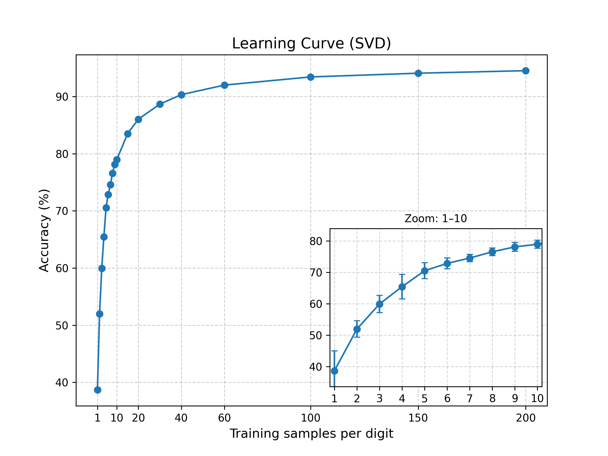

# Handwriting Recognition in Python ✍️


[](LICENSE)

This project is a Python reimplementation and extension of my university handwriting recognition project (2019/2020), originally implemented in MATLAB using SVD-based subspace methods.  
It now includes modern machine learning baselines (SVM and CNN) for comparison.

---

## Installation

Clone the repo and install requirements:

```bash
git clone https://github.com/annaewaldrd/handwriting-recognition.git
cd handwriting-recognition
pip install -r requirements.txt
```

(Optional) If you want to export your own MNIST samples:

```bash
python export_mnist_images.py
```

---

## Quick Start

After cloning the repository and installing requirements, you can quickly train and test the models:

```bash
# 1. Train SVD model on sklearn digits dataset (required before testing)
python svd_method/src/train.py --dataset digits --n_components 20

# 2. Test the trained SVD model (optionally save evaluation plots)
python svd_method/src/test.py --dataset digits --plot

# 3. Run SVM baseline (no separate training needed)
python ml_baselines/svm_digits.py

# 4. Run CNN baseline on MNIST (downloads dataset automatically)
python ml_baselines/cnn_mnist.py
```

**Notes:**
- --n_components specifies the number of SVD components per class; defaults are suggested in the SVD README.
- SVD must be trained before testing; SVM and CNN scripts handle training internally.
- For custom digits, see svd_method/predict_single.py and use the --invert flag if necessary (black-on-white digits).

---

## Methods

- **SVD Method (`svd_method/`)**  
  Classical approach using Singular Value Decomposition (SVD) to classify digits.  
  Each digit class is represented as a subspace, and classification is based on projection and reconstruction error.  
  You can test a single custom image using `predict_single.py`.


- **Modern Baselines (`ml_baselines/`)**  
  Practical machine learning methods for digit recognition:  
  - Support Vector Machine (SVM) with scikit-learn on the `digits` dataset (8x8), ~97-99% accuracy  
  - Convolutional Neural Network (CNN) with TensorFlow/Keras on MNIST (28x28), >98% accuracy after 3 epochs  

*Accuracy may vary depending on the dataset and preprocessing. See the individual scripts for details.*

---

## Data

- [`sklearn.datasets.load_digits`](https://scikit-learn.org/stable/modules/generated/sklearn.datasets/load_digits.html) (8×8 images, digits 0–9, ~1800 samples)  
- [`MNIST dataset`](http://yann.lecun.com/exdb/mnist) via TensorFlow/Keras (28×28 images, digits 0–9, 70,000 samples)  
- For reproducibility, a fixed sample of **25 MNIST images per digit** is included in `data/train` and `data/test`.  
  These are generated with `export_mnist_images.py`.  
  (The number is fixed to 25 by default, but you can easily adjust it in the script if needed.)
- You can regenerate them with: 
  ```bash
  python export_mnist_images.py
  ```

---

## Project structure

The repository is organized as follows:

```text
handwriting-recognition/
│
├── LICENSE
├── assets/               # Plots and visual outputs
├── data/                 # MNIST samples for train/test
├── ml_baselines/         # Modern ML methods (SVM, CNN)
│   ├── cnn_mnist.py
│   ├── svm_digits.py
│   └── README.md
├── svd_method/           # Classical SVD subspace method
│   ├── src/
│   │   ├── train.py
│   │   ├── test.py
│   │   ├── predict_single.py
│   │   └── utils.py
│   └── README.md
├── export_mnist_images.py
├── svd_learning_curve.py
├── svd_runtime_curve.py
├── requirements.txt
├── .gitignore
└── README.md
```

---

## Testing Your Own Digits

You can test the SVD method on your own handwritten digits (see `svd_method/README.md` for details, e.g., using the `--invert` flag for black-on-white digits).

---

## Evaluation / Results

### Results Overview

| Method | Dataset | Accuracy | Notes |
|--------|---------|----------------|-------|
| SVD | sklearn digits (8×8, ~1800 samples) | **99.83%** | Near-perfect on small, clean data |
| SVD | MNIST sample (28×28, 25 samples/class) | **84.00%** | Lower due to limited training data |
| SVM | sklearn digits (8×8) | **98.52%** | Consistent high performer |
| CNN | MNIST (28×28, 70k samples) | **98.76%** | State-of-the-art on full dataset |

> Accuracy may vary slightly due to floating-point operations or random initialization.

See `svd_method/README.md` and `ml_baselines/README.md` for detailed outputs and screenshots.

Selected evaluation plots (confusion matrix, digit-specific accuracy, error histograms, learning curves, runtime curves) are saved in the `assets/` folder.  
For clarity, only selected plots are shown here.

- **SVD (MNIST sample)**:
  

- **SVM (sklearn digits)**:
  

- **CNN (MNIST full)**:
  

> The confusion matrices highlight which digits are most often confused (e.g., 8 ↔ 1 or 5 ↔ 3).

### SVD on MNIST sample with varying training size

Accuracy was measured with **5 random seeds** per setting, mean ± std reported.

| Samples per class | Accuracy (mean ± std) | Train time (s) | Test time (s) |
|------------------:|-----------------------|----------------|---------------|
| 1   | 38.7% ± 6.3 | 0.64 | 7.71 |
| 2   | 52.0% ± 2.6 | 0.46 | 6.17 |
| 3   | 60.0% ± 2.7 | 0.44 | 6.13 |
| 4   | 65.5% ± 3.9 | 0.44 | 6.20 |
| 5   | 70.5% ± 2.6 | 0.43 | 6.29 |
| 10  | 79.0% ± 1.3 | 0.45 | 6.46 |
| 20  | 86.0% ± 0.9 | 0.50 | 17.9 |
| 40  | 90.3% ± 0.9 | 0.64 | 18.3 |
| 60  | 92.0% ± 0.6 | 0.78 | 18.3 |
| 100 | 93.4% ± 0.2 | 1.09 | 18.5 |
| 150 | 94.1% ± 0.2 | 1.51 | 18.4 |
| 200 | 94.5% ± 0.1 | 1.90 | 18.5 |



> Accuracy improves steeply with additional samples per digit, but the curve levels off after ~40 and plateaus beyond ~60, indicating diminishing returns.

### Runtime Scaling

Training and testing time scale differently with sample size:


### Summary

- **SVD:** Performs extremely well on small, clean datasets but shows lower accuracy on limited MNIST samples due to high variability. Increasing the training set from 1 → 200 samples per digit shows rapid initial improvement and then plateaus. Highly interpretable but sensitive to dataset size.  
- **SVM:** Provides consistent high accuracy on small datasets. Less interpretable but stable.  
- **CNN:** Achieves near state-of-the-art performance on the full MNIST dataset. Less interpretable, best suited for large datasets.  


**Takeaway:**  
SVD excels on small, clean datasets, SVM is robust and stable, and CNN achieves the best performance on large datasets.
For detailed plots and per-class accuracy, see the method-specific READMEs.
