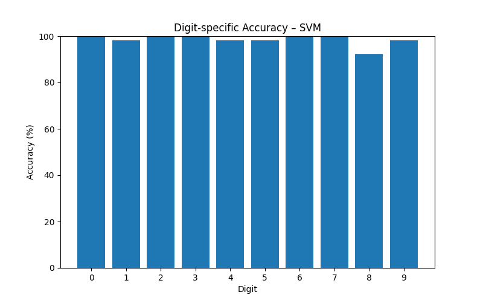
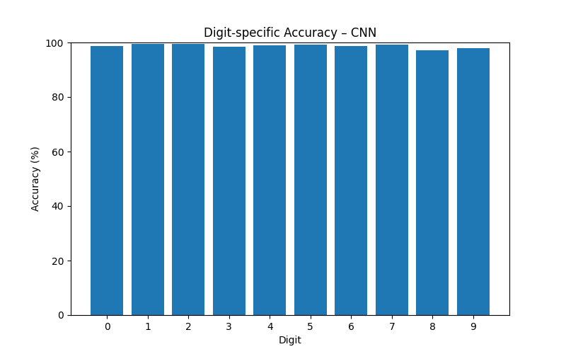

# ML Baselines: SVM & CNN

Modern machine learning baselines for handwritten digit recognition, as a comparison to SVD.

**Quick Start:** See root README.

---

## Files
- `svm_digits.py` - Support Vector Machine on sklearn digits dataset (8x8), ~97-99% accuracy  
- `cnn_mnist.py` - Convolutional Neural Network on MNIST dataset (28x28), >98% accuracy after 3 epochs  

---

## How to Run

### 1. Run Support Vector Machine (SVM) on sklearn digits (8x8)
```bash
python svm_digits.py # Optional with --plot to save plots
```

### 2. Run Convolutional Neural Network (CNN) on MNIST (28x28)
```bash
python cnn_mnist.py # Optional with --plot to save plots
```

---

**Notes:**
- The scripts run standalone, no pre-trained models needed.
- SVM automatically trains on sklearn digits (8x8).
- CNN automatically downloads MNIST dataset (28x28) via TensorFlow/Keras.
- Accuracy may vary depending on the dataset and preprocessing.

---

## SVM (sklearn digits)

Key evaluation plots for SVM:


 

**Most challenging digits (sklearn digits dataset):**
| Digit | Accuracy |
|-------|----------|
| 1     | 98.18%   |
| 4     | 98.15%   |
| 5     | 98.18%   |
| 8     | 92.31%   |
| 9     | 98.15%   |

---

## CNN (MNIST full)

Key evaluation plots for CNN:


 

**Most challenging digits (MNIST full):**
| Digit | Accuracy |
|-------|----------|
| 8     | 97.13%   |
| 9     | 98.02%   |

---

## Conclusion

- **SVM:** Reliable performance on small datasets.  
- **CNN:** Achieves top performance on large datasets.  
- CNN is the de-facto standard for image recognition, requiring more data and compute, while SVM and SVD remain valuable for small datasets and interpretability.
