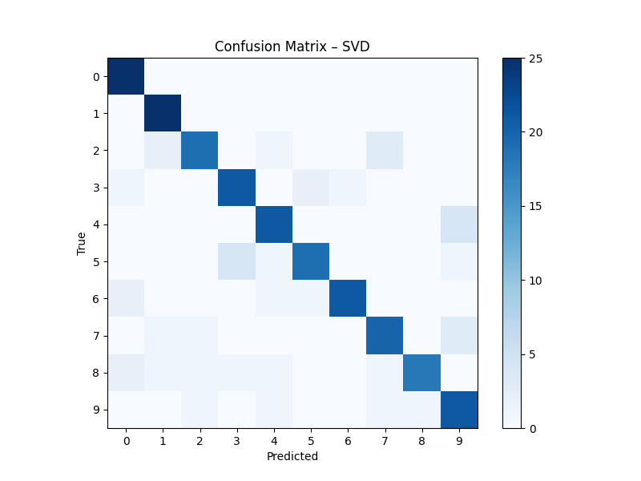
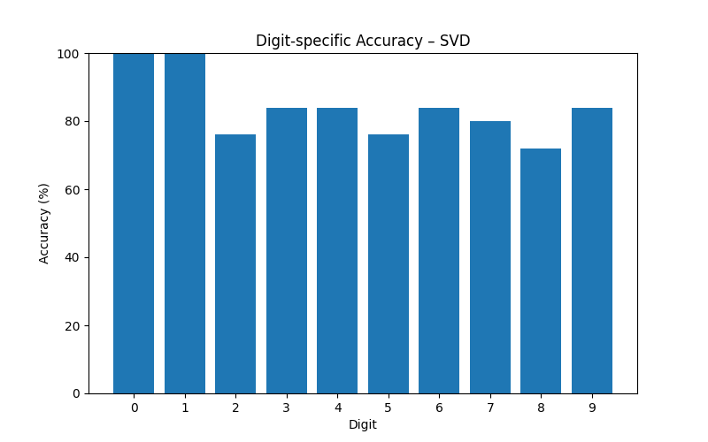
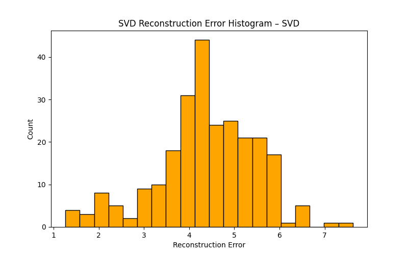
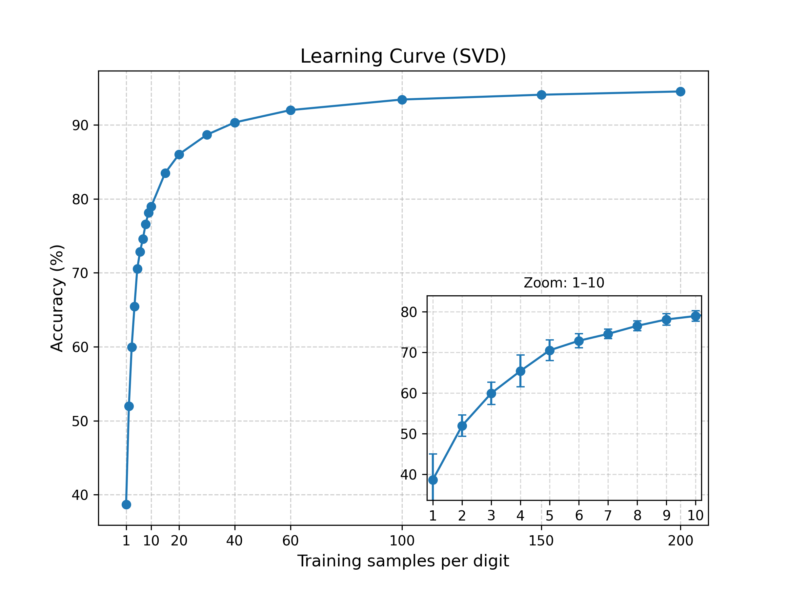
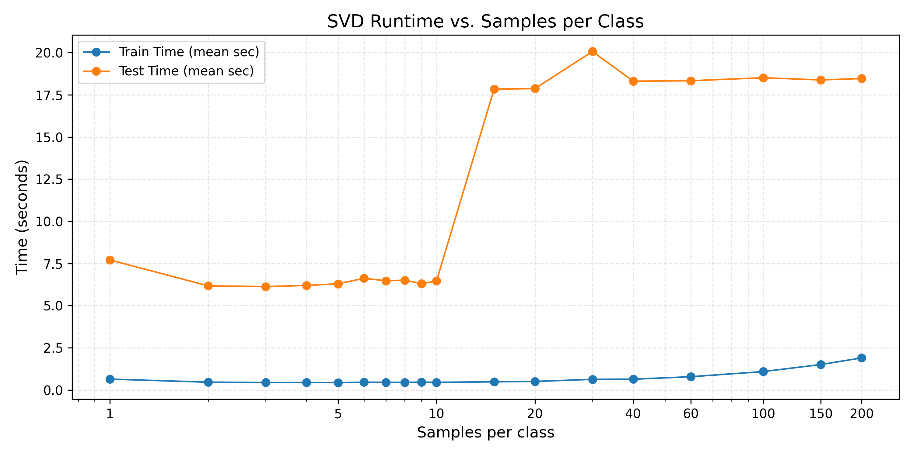

# SVD Method (Subspace Approach)

Python reimplementation of my university project (2019/2020), originally in MATLAB.  
Classifies handwritten digits using Singular Value Decomposition (SVD) by projecting into class subspaces and measuring reconstruction error.

**Quick Start:** See root README for an overview.

---

## Data
- In the original project, I worked with my own small set of handwritten images.  
- For this Python reimplementation, I use the public **`sklearn.datasets.load_digits`** dataset.  
- Additionally, this repository includes **exported MNIST samples** (25 per digit) in the `data/` folder at project root.  
  They were generated using `export_mnist_images.py`.  
  (The script defaults to 25 per digit for reproducibility, but you may edit it to export more or fewer samples if desired.)
- Optionally, you can also provide your **own digit images** (PNG/JPG).  

---

## How it Works
1. Compute SVD basis for each class (`train.py`)  
2. Project query images into class subspaces  
3. Predict based on minimum reconstruction error

---

## Run

### 1. Train the model (using sklearn digits)
```bash
cd svd_method/src
python train.py --dataset digits --n_components 20 # Sklearn digits
python train.py --dataset folder --dataset_folder ../../data/train --n_components 24 --size 28 # Train SVD on MNIST sample (25 per class)
```

**Suggested values for --n_components per dataset:**
| Dataset | n_components (suggested) |
|---------|-------------------------|
| sklearn digits (8x8, 64 features) | 10–30 (default 20) |
| Small custom set (25 samples/class) | ≤ 24 |
| Full MNIST | 50–200 (experiment) |

### 2. Test the model
```bash
python test.py --dataset digits # Sklearn digits
python test.py --dataset folder --test_folder ../../data/test --size 28 # Test SVD on MNIST sample (with --plot to save plots)
```

**Accuracy Overview**
| Dataset | Accuracy |
|---------|----------|
| sklearn digits (8×8, ~1800 samples) | **~99.8%** |
| MNIST sample (28×28, 25 samples/class) | **~84%** |

Key evaluation plots (MNIST sample):

  
  
  

**Most challenging digits (MNIST sample):**
| Digit | Accuracy |
|-------|----------|
| 2     | 76%      |
| 5     | 76%      |
| 8     | 72%      |

  


### 3. Classify a single custom image 
```bash
python predict_single.py --image ../../data/test/7/7_0.png --size 28 
```

Example: this will classify one of the included MNIST test digits (a "7").
Output: 
```nginx
Predicted digit: 7 (reconstruction error 3.15)
```

**Notes for custom images:**
- Use `--size 8` for sklearn digits, `--size 28` for MNIST/custom images
- Use `--invert` if your digit is black on white background

---

## Using Your Own Handwritten Digits

You can test the model on your own digit images (PNG/JPG).  
Guidelines:
- Resize to **28×28 pixels**.
- Convert to grayscale.
- Ensure **white digit on black background** (like MNIST).  
  If your digit is black on white paper, simply add the flag `--invert`.

Example:
```bash
python predict_single.py --image ../../data/my_digit.png --size 28 --invert
```

---

## Models

- Trained models are saved in the models/ folder as .npz files (default: svd_model.npz).
- These files are not included in the repository (see .gitignore).
- To generate a model, run train.py as described above.

---

## Mathematical details (short)

For each class $c$ with training vectors $x_i$ (flattened images):

1. Compute class mean: 
   $$\mu_c = \frac{1}{N_c} \sum_i x_i$$
2. Center the class matrix: 
   $$X_c = [x_i - \mu_c]$$
3. Compute SVD:
   $$X_c = U \Sigma V^\top$$
   Keep first $r$ columns of $U$: $U_r$
4. For a query vector $x$, compute centered vector:
   $$x_c = x - \mu_c$$
5. Project into class subspace:
   $$\mathrm{proj}_c(x) = U_r (U_r^\top x_c)$$
6. Reconstruction (residual) error:
   $$\mathrm{err}_c(x) = \|x_c - \mathrm{proj}_c(x)\|_2$$
7. Predict label:
   $$\text{label} = \arg\min_c \mathrm{err}_c(x)$$

**Python (concept):**
```python
xc = x - mean              # Center the sample
proj = U_r @ (U_r.T @ xc)  # Project into class subspace
err = np.linalg.norm(xc - proj)  # Reconstruction error

```
**Note:** Choose the number of components $r$ such that $$r \leq N_c - 1 \quad (N_c = \text{samples per class})$$

---

## Conclusion

SVD provides an interpretable baseline for handwritten digit recognition.
- Performs near-perfect on small, clean datasets (sklearn digits)
- Performance decreases on the MNIST sample due to limited training data
- Demonstrates importance of dataset size and representation
- Learning and runtime curves illustrate scaling behavior with more training samples

*SVD is strong on small, clean datasets, but less robust with limited training data compared to SVM/CNN.*
